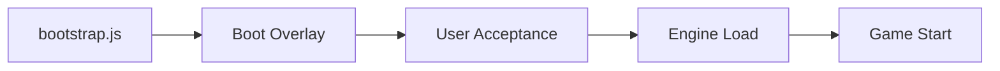

<div align="center">

# 🌲 Emberwood: The Blackbark Oath ⚔️

### *A Browser-Based Fantasy RPG & Village Simulation*

[](https://github.com/alsub25/Emberwood-The-Blackbark-Oath)
[](#license)
[](#contributing-guidelines)
[](#quick-start)

**[Play Now](https://alsub25.github.io/Emberwood-The-Blackbark-Oath/) • [Report Bug](https://github.com/alsub25/Emberwood-The-Blackbark-Oath/issues) • [Request Feature](https://github.com/alsub25/Emberwood-The-Blackbark-Oath/issues)**

---

</div>

## 🎮 About The Game

**Emberwood: The Blackbark Oath** is a rich single-page browser RPG that combines deep turn-based combat with an immersive village simulation. Your **daily decisions**—from resting at the tavern to managing finances at the bank, influencing local politics, and taking on dangerous quests—ripple through a living, breathing settlement.

> **Current Patch:** v1.2.70 — *The Blackbark Oath — Hardening & Bug Squash*  
> 📜 **In-game changelog:** Open **Changelog** from the main menu

### ✨ Key Features

This repository is intentionally **no-build** and **static-host friendly**:

- 🌐 **Runs entirely in the browser** — No backend required
- 📦 **Native ES modules** — No bundler, no build step
- 💾 **Local saves** — Persists via `localStorage` (single-player, device-local)
- 🛠️ **Developer tools included** — Smoke Tests, Scenario Runner, Bug Report bundle for testing and balancing
- 🎯 **Pure JavaScript** — Easy to understand, modify, and extend
- 📱 **Mobile-friendly** — iOS Safari compatible with special guards

---

## 📚 Table of Contents

<details>
<summary><b>Click to expand</b></summary>

- [🎮 About The Game](#-about-the-game)
- [🎯 Gameplay Highlights](#-gameplay-highlights)
- [🚀 Quick Start](#-quick-start)
- [🌐 Deploy to GitHub Pages](#-deploy-to-github-pages)
- [📂 Project Layout](#-project-layout)
- [🏗️ Architecture Overview](#️-architecture-overview)
- [⚙️ Gameplay Systems](#️-gameplay-systems)
  - [State Model & Save Schema](#state-model--save-schema)
  - [Time System & Daily Ticks](#time-system--daily-ticks)
  - [RNG & Determinism](#rng--determinism)
  - [Combat](#combat)
  - [Abilities & Effects](#abilities--effects)
  - [Status Effects & Synergies](#status-effects--synergies)
  - [Elements, Affinities & Resistances](#elements-affinities--resistances)
  - [Classes, Resources & Progression](#classes-resources--progression)
  - [Talents](#talents)
  - [Items, Inventory & Equipment](#items-inventory--equipment)
  - [Loot Generation](#loot-generation)
  - [Enemies, Rarity & Affixes](#enemies-rarity--affixes)
  - [Quests](#quests)
  - [Village Simulation](#village-simulation)
  - [Logging & UI](#logging--ui)
  - [Diagnostics & QA Tools](#diagnostics--qa-tools)
- [➕ Adding Content](#-adding-content)
- [🧪 Testing & Debugging](#-testing--debugging)
- [🤝 Contributing Guidelines](#-contributing-guidelines)
- [📋 Versioning & Releases](#-versioning--releases)
- [📜 License](#-license)

</details>

---

## 🎯 Gameplay Highlights

<table>
<tr>
<td width="50%">

### ⚔️ **Combat & Character Building**
- 🎭 **9 Unique Classes** — Mage, Warrior, Rogue, Ranger, Blood Knight, Cleric, Berserker, Vampire, Necromancer
- 💫 **Deep Ability System** — Unlock powerful spells and skills as you level up
- 🌟 **Talent Trees** — Customize your playstyle with passive bonuses
- 🎲 **Turn-Based Combat** — Strategic battles with enemy intents and combo systems
- 🔥 **Elemental Synergies** — Combine fire, ice, and other elements for devastating effects
- ⚡ **Status Effects** — Bleed, Burn, Chill, Poison, and many more

</td>
<td width="50%">

### 🏰 **Village Life & Economy**
- 🏪 **Merchant System** — Buy and sell items, with dynamic stock and pricing
- 🏦 **Banking** — Deposits, withdrawals, loans, and weekly interest
- 🎲 **Tavern Games** — Gambling mini-games and resting mechanics
- 👑 **Local Politics** — Petitions, decrees, and interactions with the king
- 📈 **Living Economy** — Prices and mood drift based on your actions
- ⏰ **Time-Based Events** — Day/night cycle affects available activities

</td>
</tr>
<tr>
<td width="50%">

### 🎒 **Loot & Equipment**
- 🗡️ **Procedurally Generated Items** — Unique weapons and armor
- ✨ **Rarity System** — Common to Legendary items with scaling stats
- 🎁 **Equipment Traits** — Special effects like on-hit procs
- 📦 **Inventory Management** — Stackable consumables and gear
- 💰 **Smart Pricing** — Dynamic sell values based on item quality

</td>
<td width="50%">

### 📜 **Quests & Progression**
- 📖 **Quest System** — Story-driven and procedural quests
- 🎯 **Multiple Quest Steps** — Complex objectives and requirements
- 🏅 **Rewards** — Gold, XP, and unique items
- 📊 **Character Progression** — Level up, distribute skill points
- 🔓 **Unlock System** — New abilities at specific levels

</td>
</tr>
</table>

---

## 📸 Screenshots & Demo

> 🎮 **[Play the live demo](https://alsub25.github.io/Emberwood-The-Blackbark-Oath/)**

### Game Features Preview

<details>
<summary>🖼️ <b>View Screenshots (Coming Soon)</b></summary>

*Screenshots will be added here to showcase:*
- 🎭 Character creation and class selection
- ⚔️ Turn-based combat system
- 🏰 Village simulation and interactions
- 🎒 Inventory and equipment management
- 📜 Quest journal and progression
- 🛠️ Developer tools and diagnostics

*To add screenshots: Place images in `/assets` and link them here*

</details>

---

## 🚀 Quick Start

### 🏃 Run Locally

Because Emberwood uses ES modules, you should run it from a local web server.

<table>
<tr>
<td width="50%">

#### 🐍 **Python**

```bash
# Python 3.x
python -m http.server 8000

# Python 2.x
python -m SimpleHTTPServer 8000
```

Then open: `http://localhost:8000`

</td>
<td width="50%">

#### 📦 **Node.js**

```bash
# Using npx (no install required)
npx serve .

# Or install serve globally
npm install -g serve
serve .
```

Then open: `http://localhost:3000` (or as shown)

</td>
</tr>
</table>

<details>
<summary>💡 <b>Other Options</b></summary>

#### 🦀 **Rust (miniserve)**
```bash
cargo install miniserve
miniserve . -p 8000
```

#### 🔵 **PHP**
```bash
php -S localhost:8000
```

#### 🟢 **Live Server (VS Code Extension)**
Install "Live Server" extension and click "Go Live" button

</details>

### 📱 iOS / `file://` Note

> ⚠️ The project includes extra guards for iOS Safari, but **serving from HTTP is still recommended**.  
> Loading modules from `file://` can be inconsistent and surface stricter module semantics.

---

## 🛠️ Technology Stack

Emberwood is built with modern web technologies, focusing on simplicity and maintainability:

<table>
<tr>
<td width="50%">

### 🎨 **Frontend**
- **Vanilla JavaScript** (ES6+ modules)
- **HTML5** & **CSS3**
- **LocalStorage API** for persistence
- **No frameworks or libraries required**

</td>
<td width="50%">

### 🏗️ **Architecture**
- **Event-driven** state management
- **Modular** design pattern
- **Data-driven** content system
- **Pure functions** for game logic

</td>
</tr>
<tr>
<td width="50%">

### 📦 **Development**
- **No build step** required
- **Native ES modules** import/export
- **Git** for version control
- **Built-in dev tools** for testing

</td>
<td width="50%">

### 🎯 **Key Features**
- **Zero dependencies** (no node_modules!)
- **Static hosting** compatible
- **Mobile-friendly** responsive design
- **Offline-capable** after first load

</td>
</tr>
</table>

---

## 🌐 Deploy to GitHub Pages

Emberwood is a static site. GitHub Pages works well.

### Option A: Deploy from the repo root

1. In GitHub: **Settings → Pages**
2. **Build and deployment → Source:** “Deploy from a branch”
3. Select branch (e.g. `main`) and folder `/ (root)`
4. Save

### Option B: Deploy from `/docs`

If you prefer keeping source separate from the site output:

1. Move `index.html`, `style.css`, `assets/`, `js/` into `/docs`
2. GitHub: **Settings → Pages → Source:** `main` + `/docs`

### Pathing

All scripts/styles use **relative paths**, so Pages works whether deployed at the root domain or under a repository subpath.

---

## 📂 Project Layout

### 📁 Top Level Structure

```
Emberwood-The-Blackbark-Oath/
├── index.html          # Main entry point
├── style.css           # Game styling
├── assets/             # Images and resources
├── js/                 # JavaScript modules
│   ├── boot/          # Boot sequence
│   ├── game/          # Core game logic
│   └── shared/        # Shared utilities
└── README.md          # This file
```

### 🗂️ JavaScript Module Organization

<details>
<summary><b>📦 Boot System</b> <code>js/boot/</code></summary>

- **`bootstrap.js`** — Boot sequencing + optional preflight checks
- **`bootLoader.js`** — Boot overlay + timing
- **`userAcceptance.js`** — Acceptance gate / user prompt logic
- **`lib/safeStorage.js`** — Minimal boot-safe storage wrapper

</details>

<details>
<summary><b>🔧 Shared Utilities</b> <code>js/shared/</code></summary>

- **`storage/safeStorage.js`** — Dependency-light utilities shared by boot + game

</details>

<details>
<summary><b>🎮 Game Engine</b> <code>js/game/engine/</code></summary>

**Core Orchestration:**
- **`engine.js`** — Main entry (state orchestration, gameplay flow)
- **`saveManager.js`** — Save/load + migrations + save-slot helpers
- **`storageRuntime.js`** — Runtime storage diagnostics / safe wrappers
- **`perf.js`** — Performance capture helpers

**UI Layer:**
- `ui/uiRuntime.js` — Screen switching, modal runtime, log renderer helpers
- `ui/uiBindings.js` — DOM event wiring (menu buttons, HUD gestures, chips)

**Developer Tools:**
- `devtools/diagnosticsUI.js` — Smoke Tests modal UI + dev pill visibility

</details>

<details>
<summary><b>📊 Game Data</b> <code>js/game/data/</code></summary>

- **`abilities.js`** — All ability definitions (spells, attacks, etc.)
- **`items.js`** — Item definitions and equipment data
- **`talents.js`** — Talent tree definitions

</details>

<details>
<summary><b>⚔️ Combat System</b> <code>js/game/combat/</code></summary>

- **`math.js`** — Damage/heal calculations, crit handling, mitigation
- **`statusEngine.js`** — Status ticking / application / stacking rules
- **`abilityEffects.js`** — Ability implementations
- **`postTurnSequence.js`** — End-of-turn sequencing

</details>

<details>
<summary><b>🔄 Core Systems</b> <code>js/game/systems/</code></summary>

- **`timeSystem.js`** — Day/day-part handling + normalization
- **`rng.js`** — Deterministic RNG option + logging
- **`lootGenerator.js`** — Item generation pipeline
- **`kingdomGovernment.js`** — King behavior + decree logic
- **`assertState.js`, `safety.js`** — Invariants and guardrails
- **`enemy/`** — Enemy generation pipeline (templates/rarity/affixes)

</details>

<details>
<summary><b>🏘️ Village System</b> <code>js/game/locations/village/</code></summary>

- **`merchant.js`** — Shop system and trading
- **`bank.js`** — Financial system
- **`townHall.js`** — Politics and decrees
- **`tavern.js`, `tavernGames.js`** — Rest and gambling
- **`villageEconomy.js`** — Economic simulation
- **`villagePopulation.js`** — Population mood and behavior

</details>

<details>
<summary><b>📜 Quest System</b> <code>js/game/quests/</code></summary>

- **`questDefs.js`** — Quest definitions
- **`questDefaults.js`** — Default state and flags
- **`questBindings.js`** — Side effects and trigger wiring
- **`questSystem.js`** — Lifecycle helpers
- **`questTriggerRegistry.js`** — Registry of trigger types

</details>

<details>
<summary><b>📝 Changelog</b> <code>js/game/changelog/</code></summary>

- **`changelog.js`** — In-game changelog data

</details>

---

## 🏗️ Architecture Overview

Emberwood is designed around a single **authoritative game state object** plus a set of systems that read/update it.

### 🚀 Boot Sequence



1. **`js/boot/bootstrap.js`** runs first
2. Boot overlay displays with diagnostics
3. User acceptance handled (`userAcceptance.js`)
4. Game engine entry (`js/game/engine/engine.js`) imports
5. Game initializes and loads

### 🎯 Engine Orchestration

The `engine.js` module coordinates all major systems:

- 🏗️ **Building/initializing state** — Creates the initial game state
- 💾 **Save Management** — Calls `saveManager` for load/save/migrate operations
- 🎨 **UI Wiring** — Delegates to `uiRuntime` + `uiBindings` for all UI interactions
- ⚙️ **System Delegation** — Manages time, RNG, loot, quests, village systems
- ⚔️ **Combat Modules** — Handles turn-based combat during fights

### 🔧 Key Refactors in v1.2.70

The **Hardening & Bug Squash** patch introduced major architectural improvements:

- ✅ **Save/Migrations** — Extracted to dedicated `saveManager.js`
- ✅ **UI Runtime + Bindings** — Separated into `uiRuntime.js` / `uiBindings.js`
- ✅ **Diagnostics/QA UI** — Moved to `devtools/diagnosticsUI.js`

> 💡 These extractions reduce circular imports and avoid iOS `file://` pitfalls (temporal dead zones, read-only imported bindings).

---

## ⚙️ Gameplay Systems

### State model & save schema

The game uses one top-level `state` object. The save payload is a normalized subset of runtime state (plus metadata).

Common state buckets:

- `player`: stats, level, HP/resource, inventory, equipment, class config
- `time`: day index + day part
- `combat`: current encounter runtime (only present when in combat)
- `quests`: quest progression data
- `village`: economy + population state
- `government`: decrees/petitions/king state
- `bank`: deposits/loans/interest timing
- `flags`: toggles (dev cheats, deterministic RNG, debug modes)
- `log`: structured log entries + filters
- `ui`: current screen, modal state, UI toggles

Persistence:

- Stored in `localStorage` using safe wrappers (private mode / quota failures are guarded).
- Multiple save slots are supported through an index + per-slot blob keys.

Migration:

- `saveManager.js` applies ordered migrations when loading.
- Migrations normalize missing/older fields and keep forward-compat safety (unknown keys are tolerated).

### Time system & daily ticks

`timeSystem.js` tracks time as **day index** + **day part**.

- `normalizeTime()` clamps time into valid ranges.
- `advanceTime()` advances day-part and wraps to the next day as needed.

Daily ticks:

When time advances in ways that represent a “world tick” (resting, end-of-day), the engine runs a deterministic daily pipeline:

- Economy adjustments
- Merchant restock + pruning
- Decree expiration / effects
- Bank interest timing
- Population mood drift

There is an idempotence guard to prevent “double tick” bugs.

### RNG & determinism

`rng.js` supports:

- Normal RNG (non-deterministic)
- Deterministic RNG for reproducing bugs
- Optional RNG logging (capped)

This is used across loot rolls, enemy generation, and combat variance.

### Combat

Combat is turn-based and supports single-enemy and multi-enemy battles.

Core components:

- `combat/math.js`: damage/heal computations, crit, mitigation
- `combat/statusEngine.js`: status application and ticking
- `combat/abilityEffects.js`: ability implementations (damage, heal, buffs)
- `combat/postTurnSequence.js`: end-of-turn cleanup, status expiry, intent ticking

Key mechanics:

- **Enemy intent**: enemies can “wind up” actions that execute after a countdown.
- **Interrupt**: player can interrupt certain intents (resource cost + posture interaction).
- **Posture**: posture break disrupts enemy intent.
- **AoE**: group abilities apply to all enemies and now correctly resolve multi-enemy defeats.

Safety:

- Damage/heal values are clamped and validated to prevent NaN/Infinity cascades.
- Combat runtime fields are repaired/initialized during load for forward compatibility.

### Abilities & effects

Abilities are defined in `js/game/data/abilities.js` and implemented in `combat/abilityEffects.js`.

Each ability specifies:

- Cost (resource)
- Targeting (self, enemy, group)
- Classification (physical or elemental)
- Effect pipeline (damage/heal + status application)

Effects are kept separate from UI so they can be tested deterministically.

### Status effects & synergies

Status effects are handled by `statusEngine.js`.

Typical status fields:

- `duration` (turns)
- `stacks` or magnitude (where applicable)
- Optional per-turn tick behavior

Synergies (examples):

- Bleed + Fire can ignite (Burning)
- Chilled + Physical can Shatter and consume Chill

### Elements, affinities & resistances

Damage classification:

- Physical or elemental
- Elemental types normalized via helpers to avoid mismatched keys

Enemies:

- Can have affinity multipliers (weakness/resistance)
- Can have flat resist percentages

Players:

- Can gain elemental bonuses/resists from gear and talents
- Elemental resist reduces incoming elemental damage

The combat math stacks affinity and resist effects multiplicatively and avoids printing misleading “0% resist” breakdown lines.

### Classes, resources & progression

Classes define:

- Base stats and growth
- Resource type (e.g., mana)
- Unlock tables (abilities/spells at specific levels)

Progression systems:

- Leveling grants skill points and talent points.
- Cheats can grant max level and auto-distribute skill points (testing).

### Talents

Talents are defined in `js/game/data/talents.js`.

Talents can:

- Modify derived stats immediately
- Add elemental bonuses/resists
- Change combat thresholds (e.g., rhythm mechanics)
- Add conditional passives

Talent changes are applied via stat recomputation to ensure idempotence.

### Items, inventory & equipment

Items are defined in `js/game/data/items.js`.

Inventory rules:

- Stackable items (e.g., potions) normalize to a `quantity` integer.
- Equipment does **not** stack; each piece is an instance.
- Equip/unequip updates derived stats and guards against double-application.
- Selling equipped gear clears the slot and uses centralized `getSellValue`.

Traits:

- Equipment can carry traits that trigger on-hit, on-kill, etc.

### Loot generation

`lootGenerator.js` creates items with:

- Weighted rarity rolls
- Deterministic results under seeded RNG
- Safety guarantees (finite stats, normalized elements)

Loot stress tests ensure the generator remains stable under large batches.

### Enemies, rarity & affixes

Enemy creation is pipeline-driven in `systems/enemy/`:

- `rarity.js`: rarity selection & reward scaling
- `elite.js`: elite/boss rules
- `affixes.js`: affix selection and behavior flags
- `builder.js`: builds a runtime enemy instance from a template
- `display.js`: naming and presentation helpers

Enemies can have:

- Elemental affinities/resists
- Affixes (thorns, vampiric, regenerating, frozen, etc.)
- Difficulty-scaled stats

### Quests

The quest system is split across:

- `questDefs.js`: quest definitions (steps, requirements)
- `questDefaults.js`: default state and flags
- `questBindings.js`: side effects and trigger wiring
- `questTriggerRegistry.js`: registry of trigger types
- `questSystem.js`: lifecycle helpers (init/start/advance/complete)

Design goal: keep quests data-driven, with bindings used only for world integration.

### Village simulation

Village modules live in `js/game/locations/village/`.

Core sub-systems:

- **Merchant (`merchant.js`)**: stock, buy/sell, restock guards, price behavior
- **Economy (`villageEconomy.js`)**: derived multipliers and cost models
- **Population (`villagePopulation.js`)**: mood drift and summaries
- **Bank (`bank.js`)**: deposits/withdrawals, loans, weekly interest timing
- **Town Hall (`townHall.js`)**: petitions and time-limited decrees
- **Tavern (`tavern.js`, `tavernGames.js`)**: resting and gambling mini-games

These are invoked through location UI and through daily tick hooks.

### Logging & UI

UI is separated into runtime vs bindings:

- `uiRuntime.js`:
  - `switchScreen()` with missing-DOM guards
  - modal runtime (open/close, focus trap)
  - log helpers + rendering
  - breakdown formatting helpers used by combat logs

- `uiBindings.js`:
  - Menu buttons (New/Load/Settings)
  - HUD gestures (tap/swipe)
  - Log filter chips (pills)
  - Modal dismissal / close wiring

Log entries are structured with a `type` (system/good/danger) and optional metadata (combat breakdowns, procs, etc.).

### Diagnostics & QA tools

Developer tools are intended for testing and balance work.

- Enable cheats during character creation.
- When enabled, HUD pills appear for:
  - **Cheat Menu**
  - **Smoke Tests & Bug Report**

`devtools/diagnosticsUI.js` owns the Diagnostics modal UI and pill visibility.

Tools included:

- **Smoke Tests**: isolated in-memory QA suite (does not modify the active save)
- **Scenario Runner**: simulates multiple days and loot generation to catch regressions
- **Bug Report Bundle**: exports a JSON bundle (state snapshot + perf + recent log)
- **Perf Snapshot**: boot/FPS summary for profiling
- **Live Save Audit**: checks invariants on the current save

Implementation note (important for iOS Safari):

- QA uses adapters/hooks instead of reassigning imported ES-module bindings, because imported bindings are read-only.

---

## ➕ Adding Content

### 👹 Add an Enemy

1. 📝 Find the enemy template table (commonly in engine or enemy builder inputs)
2. ➕ Add a new template ID and base stats/move list
3. 🎮 Use **Cheat Menu → spawn/start battle** by `templateId`
4. 🔄 Iterate until the encounter feels right

### 🗡️ Add an Item

1. 📝 Add an entry in `js/game/data/items.js`
2. ✅ Confirm:
   - 📦 Inventory display
   - ⚔️ Equip rules (if equipment)
   - 💰 Sell value
   - 🎲 Loot generator behavior
3. 🎮 Use **Cheat Menu** to grant by item ID for fast iteration

### ✨ Add an Ability

1. 📝 Add the ability definition in `js/game/data/abilities.js`
2. 💻 Implement its logic in `js/game/combat/abilityEffects.js`
3. 🔓 Add unlock rules for a class if needed
4. 🧪 Run **Smoke Tests** (abilities classification checks will fail fast if misconfigured)

### 🌟 Add a Talent

1. 📝 Add the talent in `js/game/data/talents.js`
2. 📊 Ensure it updates derived stats through the stat recompute pipeline
3. 🧪 Run **Smoke Tests** (talent integrity + summary checks will catch many mistakes)

### 📖 Add a Quest

1. 📝 Define in `js/game/quests/questDefs.js`
2. 🔧 Add default state in `questDefaults.js`
3. 🔗 Bind triggers in `questBindings.js` using the trigger registry
4. ✅ Verify lifecycle with **Smoke Tests** (quest init/start/advance/complete)

---

## 🧪 Testing & Debugging

### Smoke Tests

Open **Smoke Tests & Bug Report** and click **Run**.

- The suite swaps game state in-memory so it won’t corrupt your save.
- Mobile runs may default to a “quick mode” to keep runtime low.
- Full mode is available for deeper runs.

### Scenario Runner

Use **Scenario** to simulate multiple days and loot batches. This catches:

- Daily tick idempotence bugs
- Economy drift issues
- Loot generator invalid outputs

### Bug reports

Use **Copy JSON** to export a bundle containing:

- Patch label + save schema
- UA/locale
- State snapshot
- Recent input log tail
- Recent game log tail
- Perf snapshot

For reproducible reports:

1. Enable deterministic RNG
2. Set a seed
3. Reproduce
4. Copy JSON and attach to a GitHub issue

---

## 🤝 Contributing Guidelines

We welcome contributions! Here's how to get started:

### 🎯 Design Goals

- 📦 **Keep systems small and single-purpose** — Modular architecture
- 🧩 **Prefer pure logic modules** (no DOM) for core mechanics
- 🔌 **Use UI adapters/hooks** rather than importing gameplay code into UI modules
- 📝 **Document your changes** in the changelog for significant updates

### ⚠️ iOS / ES Module Pitfalls to Avoid

- 🚫 **Temporal dead zones**: Avoid referencing late-bound functions during module evaluation
- 🚫 **Read-only imports**: Never assign to an imported binding; use adapters
- ✅ **Keep boot + version modules dependency-light**

### 💅 Style Guidelines

- ✨ Keep helpers dependency-light
- 🔗 Avoid cross-layer imports (systems → UI)
- 📋 Add changelog entries for behavior changes and major refactors
- 🧪 Run Smoke Tests before submitting PRs

### 🔄 Pull Request Process

1. 🍴 Fork the repository
2. 🌿 Create a feature branch (`git checkout -b feature/AmazingFeature`)
3. 💾 Commit your changes (`git commit -m 'Add some AmazingFeature'`)
4. 🚀 Push to the branch (`git push origin feature/AmazingFeature`)
5. 📬 Open a Pull Request

---

## 📋 Versioning & Releases

### 🏷️ Patch Label

The build label lives in `js/game/systems/version.js`:

- **`GAME_PATCH`** — Version number (e.g., "1.2.70")
- **`GAME_PATCH_NAME`** — Patch name (e.g., "The Blackbark Oath")
- **`GAME_FULL_LABEL`** — Combined label for display

### 📝 In-Game Changelog

Changelog entries live in `js/game/changelog/changelog.js`.

- Visible from the main menu **Changelog** button
- Documents new features, fixes, and improvements
- Organized by patch version

### 💾 Save Schema

The smoke tests print the current **save schema**. When changing save structure:

- ✅ Add/adjust migrations in `saveManager.js`
- ✅ Keep migrations tolerant of unknown keys for forward compatibility
- ✅ Test loading saves from previous versions

---

## 📜 License

This project is open source. Please add a `LICENSE` file that matches your intent (MIT/GPL/Proprietary).

**Third-party assets:**  
If you add third-party assets, list sources and licenses in this section.

---

<div align="center">

## 🌟 Support The Project

If you enjoy Emberwood: The Blackbark Oath, consider:

⭐ **Starring the repository**  
🐛 **Reporting bugs** via [Issues](https://github.com/alsub25/Emberwood-The-Blackbark-Oath/issues)  
💡 **Suggesting features** via [Issues](https://github.com/alsub25/Emberwood-The-Blackbark-Oath/issues)  
🤝 **Contributing** via Pull Requests

---

Made with ❤️ by the Emberwood community

**[⬆ Back to Top](#-emberwood-the-blackbark-oath-️)**

</div>
